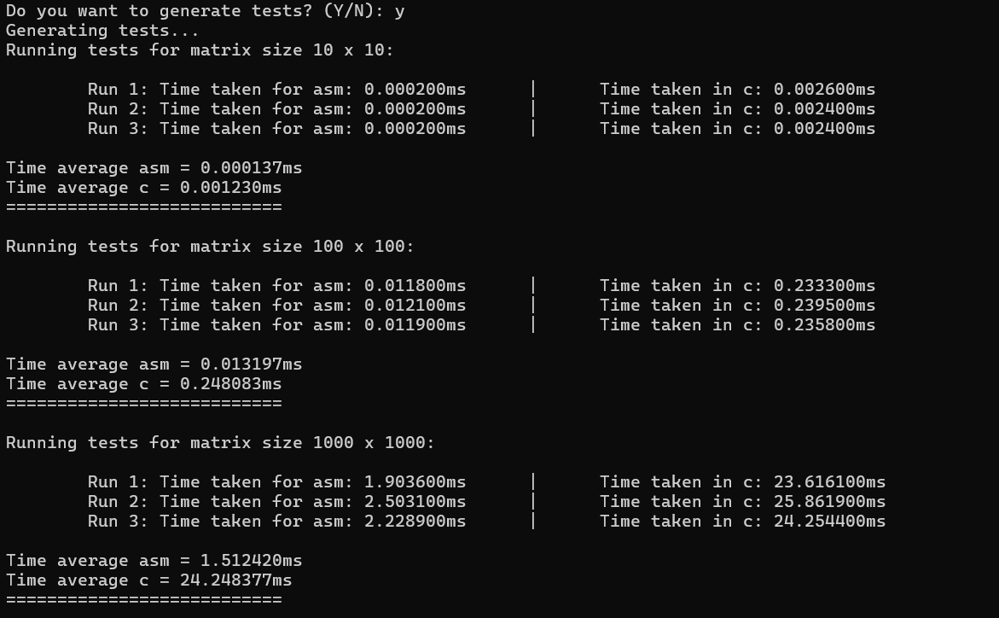

# LBYARCH: MP2 GrayScale Single Precision Image to Unsigned 8-Bit Integer

Members:
Paul Josef P. Agbuya,
Ken Ivan T. Cheng

Running Visual Studio
1.) Open Local Folder look for MP2_AGBUYA_KEN

2.) select .sln file

Running the program:

1.) cd .\MP2_AGBUYA_KEN\x64\Debug

2.) MP2_AGBUYA_KEN

3.) input1.txt

4.) Y

For the following tests, the following becnhmark results are produced with the corresponding execution times. Each run has a different randomized input within that dimension over. It will repeat further 30 times for the average execution time. 
Enter matrix dimensions: 10x10, 100x100, and 1000x1000. Each program has been run 30 times with the same corresponding randomized inputs. Three sample runs are provided to see how the run of each code in C and x86-64 assembly is running.

Running tests for matrix size 10 x 10:

        Run 1: Time taken for asm: 0.200000ms      |      Time taken in c: 2.800000ms
        Run 2: Time taken for asm: 0.300000ms      |      Time taken in c: 2.600000ms
        Run 3: Time taken for asm: 0.200000ms      |      Time taken in c: 1.800000ms

Time average asm = 0.136667ms
Time average c = 1.176667ms
===========================

Running tests for matrix size 100 x 100:

        Run 1: Time taken for asm: 14.800000ms      |      Time taken in c: 235.200000ms
        Run 2: Time taken for asm: 17.400000ms      |      Time taken in c: 237.900000ms
        Run 3: Time taken for asm: 16.600000ms      |      Time taken in c: 230.100000ms

Time average asm = 12.196667ms
Time average c = 219.836667ms
===========================

Running tests for matrix size 1000 x 1000:

        Run 1: Time taken for asm: 1383.000000ms      |      Time taken in c: 23528.200000ms
        Run 2: Time taken for asm: 1404.700000ms      |      Time taken in c: 23591.500000ms
        Run 3: Time taken for asm: 2173.600000ms      |      Time taken in c: 23720.200000ms

Time average asm = 1504.033333ms
Time average c = 24031.220000ms
===========================

## Performance Result
A bit of background beneath the processes in ``*imgCvtGrayFloatToInt()*`` and ``*imgCvtGrayFloatToInt_c()*``. Functions belonging to x86-64 asm and C respectively. Array of 2-Dimensions was implemented in C, and it is how it was allocated. Making ``*imgCvtGrayFloatToInt()*`` need to process two pointers and then correspondingly converting it via multiplying to 255.0 then back to integer. The C programming function would need additional logic comparing the round to nearest and an additional ties to even condition.
| Matrix (h x w) | x86-64 asm   (ave ms) | C lang (ave ms)  | Speed Scale asm  | Decrease asm over C|
|----------------|-------------------|--------------| ------------------|------------------|
| 10x10          | 0.000137	     | 0.001230	    | 8.98x		| 88.86%		|
| 100x100        | 0.013     | 0.248    | 18.80x		| 94.68%	|
| 1000x1000      | 1.512     | 24.248     | 16.03x		| 93.76%		|

In the 10x10 instance, it is apparent that the assembly implementation of the function ``*imgCvtGrayFloatToInt()*`` it resulted to about 88.86% decrease in average execution time in comparison to C programming implementation. Making its speed to be 8.98x faster. This dimensions of 10x10 can be seen as where we see asm has the least impact in relation to the other results. This can be due to the fact the C program needs a bit more rounding logic to align with the round to nearest ties to even that the result of cvtss2si from SIMD functions that happen in the assembly language.

Same conclusion can be met with 100x100, only for this instance its a bit more prevalent. Around 94.68% decrease on average execution time than C program implementation. Around 18.80 times faster than the C program implementation and the most significant out of the 3 cases.

Lastly, the 1000x1000 which means the resulting averages make the x86-64 function be 93.76% decrease on average execution time than the C function. Also about 16.03x faster, yielding itself to be the 2nd best impact out of the three cases. So for dimensions around 100x100 matrix we would notice the best difference from C to asm.

One input from 10x10 dimension shown and its output (inputs located at input1.txt):

## Raw outputs in the Console

# Correctness test

For the correctness test we will be using python's round function as their integer rounding follows round to nearest, ties to even conditions. It is run under PyCharm Community 2024 as the IDE, or simply use the command python main.py. The code implementation of python follow produce as so:

Our main focus for checking is whether pythons calculated result would be equal the result of either from C or assembly. Using the numpy function for equal, this line for `print(np.array_equal(new, given))` we will easily get a brief indication on the lower dimension of 10x10 that the result is true or false at the last line of the output.

# Results of Correctness:

## Given Calculated x86-64 asm

## Given Calculated C Program

Overall, both functions produced accurate information that is expected to follow under the assumption: Map Grayscale float to 255.0 then follow round to nearest integer then ties to even. Following the proportion below

That simplifies to the equation:  `255f = i

# Short video

